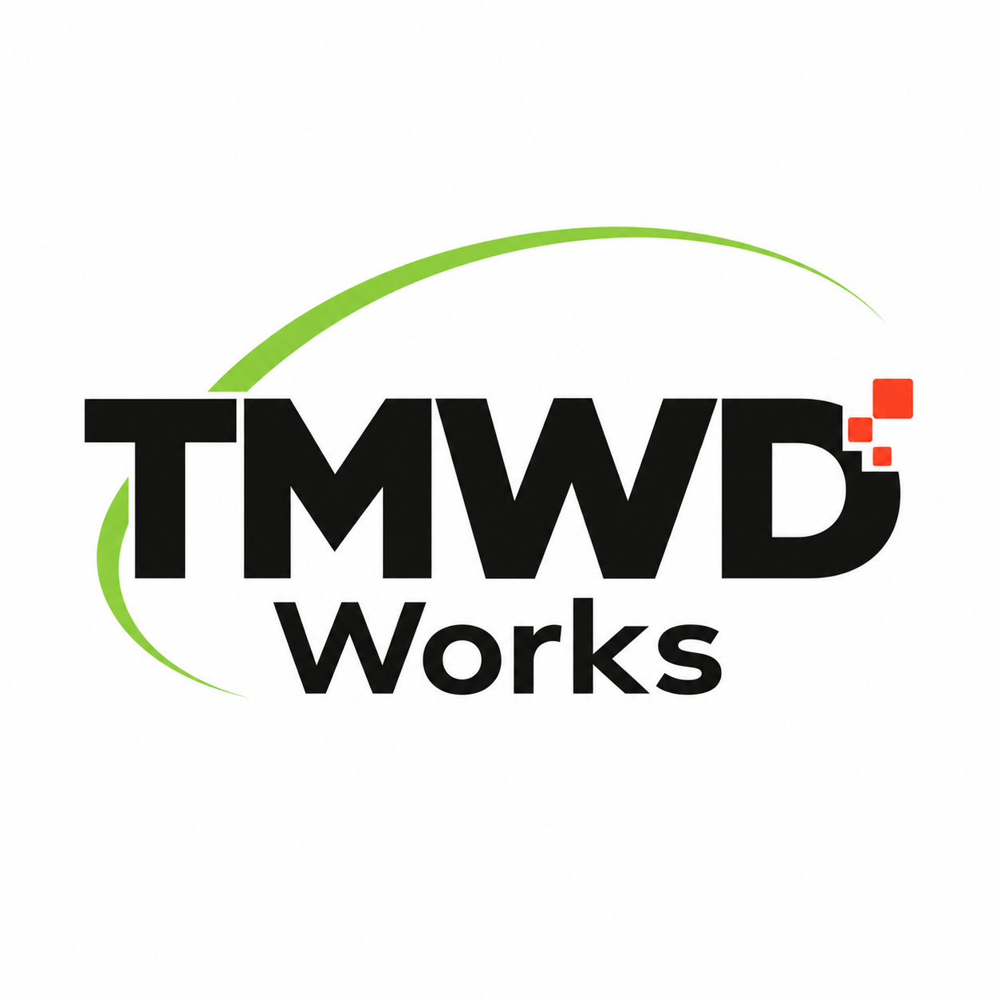

  

# TMWD Works

**AI, Software Development & IT Infrastructure**

TMWD Works is an independent engineering brand based in Urayasu, Chiba, Japan.

We work across software development, generative AI, local AI environments, Linux systems, and related IT infrastructure.

## What we work on

- Generative AI applications and tools
- Local LLM and RAG environments
- AI agent integration and experimentation
- Python-based tools and automation
- Software and web application development
- Linux server and IT infrastructure
- Network, NAS, and remote-access environments
- Security-conscious system design and operation

## Engineering approach

We focus on practical systems that can be understood, operated, and maintained in real-world environments.

Rather than treating AI as an isolated technology, we consider the surrounding software, infrastructure, networking, security, and operational requirements as part of the overall system.

---

**TMWD Works**  
Tomoyuki Wada  
Urayasu, Chiba, Japan
